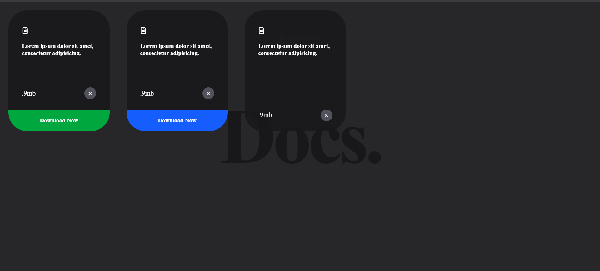

# 📄 DocFlow

**DocFlow** is a modern, animated document interface where users can drag and interact with floating document cards. Built with **React**, **Tailwind CSS**, and **Framer Motion**, it combines smooth UX with clean UI.

---

## ✨ Features

- 🧲 **Drag-and-drop** card interface
- 💡 **Interactive file tags** (Download/Upload)
- 🎨 **Responsive & dark-themed UI**
- ⚙️ Powered by **Framer Motion** for animations
- 💻 Built with **React** and **Tailwind CSS**

---

## 📸 Preview

---

 
## 🚀 Demo

[DocFlow Preview](https://drive.google.com/file/d/1xzU3tFxgTkm9wK7AzeX9k3y3dd74u5Bf/view?usp=sharing)

---

## 📦 Tech Stack

- **React**
- **Tailwind CSS**
- **Framer Motion**
- **React Icons**

---

